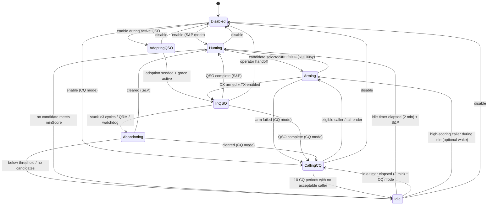

# FT8 Auto Bot — Design Document

**Status:** Draft  
**Target:** wsjt-z (WSJT-X fork)  
**Modes:** FT8, FT4 (initial); FT2 optional later  
**Author intent:** Full-cycle automated DX hunting beyond existing Auto CQ / Auto Call

---

## 1. Purpose and scope

### 1.1 Problem statement

Existing wsjt-z automation (`Auto CQ`, `Auto Call`, `Auto Seq`, filters, band hopper) covers fragments of the operating loop:

| Capability | Auto CQ | Auto Call | Gap |
|------------|---------|-----------|-----|
| Transmit CQ automatically | Yes | No | — |
| Pick a station from decodes | No | Yes (one cycle) | No persistent hunt strategy |
| Run full QSO state machine | Partial (via Auto Seq) | Partial | No bot-owned stuck detection |
| Remember tried / failed stations | No | No | Worked file + 30 min cooldown |
| Never re-work same station | Filter only | Filter only | Worked text file (permanent) |
| Prioritize new DXCC + max distance | Partial (filters/priority) | Partial | Unified score: new call, new DX, distance |
| Back off when band is dead | No | No | Idle: low score / CQ×10 / 2 min listen |
| Abandon blocked QSO (>3 cycles) | Watchdog only | Watchdog only | Bot must replan explicitly |
| Dedicated decision UI + file log | QSO Monitor (shared) | QSO Monitor (shared) | Need bot-specific view |

The **FT8 Auto Bot** is a self-contained C++ controller that, when enabled, takes over target selection and QSO lifecycle while delegating message generation, encoding, and transmit timing to standard WSJT-X code paths.

### 1.2 Non-goals (v1)

- Replacing `auto_sequence()` message parsing or contest-specific exchanges.
- Fox/Hound, DXpedition, or Super Fox modes.
- Band hopping logic (may *trigger* band hopper later; not reimplemented).
- Fully unattended operation without operator toggle (consistent with WSJT-X philosophy in `make-qso.adoc`).
- WSPR, JT modes, MSK144, etc.

### 1.3 Success criteria

1. Operator toggles bot ON → bot selects targets, starts QSOs, completes or abandons them, then selects the next target without manual DX field edits.
2. **Worked callsigns** are appended to a text file and are **never called again** (permanent global block for now).
3. **Failed QSOs** put the callsign on a **30-minute cooldown** list; the bot will not call them again until cooldown expires.
4. Target selection is **score-based** using three factors: **new callsign**, **new DXCC**, and **distance** (see §5.2), with an operating threshold that defaults to `minScore = 1000`.
5. If no candidate meets the operating threshold, or no eligible station exists → **Idle** for 2 minutes (receive only, no TX).
6. In CQ mode, after **10 CQ transmissions** with no acceptable caller → **Idle** (receive only) until decodes warrant action.
7. QSO stuck without progress for **>3 FT8/FT4 cycles** → abandon, cooldown, replan.
8. Qt window shows live state, counters, last decision, score breakdown, and rolling decision log.
9. Append-only debug file records every state transition and scoring decision.

---

## 2. Architectural overview

### 2.1 Component diagram

```
┌─────────────────────────────────────────────────────────────────┐
│ MainWindow (existing)                                           │
│  decode path ──► FT8AutoBot::on_decode()                        │
│  period tick ──► FT8AutoBot::on_period_boundary()               │
│  QSO events  ──► FT8AutoBot::on_qso_progress() / on_qso_logged()│
│                                                                 │
│  ◄── FT8AutoBot signals: set_dx(), enable_tx(), clear_dx(),     │
│                           auto_tx_mode(), stop_tx()             │
└───────────────────────────────┬─────────────────────────────────┘
                                │
        ┌───────────────────────┼───────────────────────┐
        ▼                       ▼                       ▼
┌───────────────┐     ┌─────────────────┐     ┌──────────────────┐
│ FT8AutoBot    │     │ FT8AutoBotMemory│     │ FT8AutoBotWindow │
│ (controller)  │────►│ (persistence)   │     │ (Qt UI)          │
└───────────────┘     └─────────────────┘     └──────────────────┘
        │
        ▼
┌───────────────┐
│ FT8AutoBotLog │
│ (file logger) │
└───────────────┘
```

### 2.2 Design principles

1. **Delegate, don't duplicate** — Use `processMessage()`, `auto_sequence()`, `on_txb1_clicked()`, `useNextCall()`, `auto_tx_mode()`, `clearDX()`, and existing `m_QSOProgress` states. The bot decides *who* and *when*; WSJT-X decides *what message*.
2. **Single owner** — When bot is active, `cbAutoCQ` / `cbAutoCall` are disabled; bot subsumes their role.
3. **Testable core** — Scoring, memory lookups, and state transitions live in `FT8AutoBot` with minimal QWidget dependencies.
4. **Observable** — Every decision emits UI + file log lines with category, reason, and structured fields.

### 2.3 New source files

| File | Role |
|------|------|
| `widgets/FT8AutoBot.hpp` | Controller class (QObject) |
| `widgets/FT8AutoBot.cpp` | State machine, scoring, integration |
| `widgets/FT8AutoBotMemory.hpp` | Station attempt/worked/no-answer store |
| `widgets/FT8AutoBotMemory.cpp` | Worked list (text file) + cooldown list (text/JSON) |
| `widgets/FT8AutoBotWindow.hpp` | Dedicated Qt monitor/control window |
| `widgets/FT8AutoBotWindow.cpp` | UI layout and binding |
| `tests/test_ft8_auto_bot.cpp` | Unit tests for scoring and memory |

CMake: add to `wsjt_qt` / main target alongside `QSOMonitorWindow.cpp`.

---

## 3. Operating modes

### 3.1 Mode enum

```cpp
enum class FT8AutoBotMode {
  SearchAndPounce,  // default: scan decodes, call best eligible CQ/RR73
  CQ                // call CQ; answer tail-enders / callers per WSJT-X rules
};
```

### 3.2 Search & Pounce (S&P)

**Behavior:**

1. Bot idle in `Hunting` state (no DX call set, `m_QSOProgress == CALLING`).
2. Each decode cycle, eligible stations are scored (§5).
3. Best candidate becomes `m_target`; bot invokes existing answer path:
   - Set `m_nextCall`, `m_prioFreq`, `m_prioGrid`, `m_prioTxFirst`, report
   - `dxLookup()`, `useNextCall()`, `on_txb1_clicked()`, `auto_tx_mode(true)`
4. `Auto Seq` is forced ON while bot is active.
5. QSO runs via standard `auto_sequence` → `processMessage`.
6. On complete → mark worked (permanent); on fail / abandon → 30 min cooldown; return to `Hunting` or `Idle` if nothing worth calling.
7. If no candidate meets `minScore` or no candidates exist → `Idle` for 2 minutes (listen only).

**Mapping to today:** Equivalent to Auto Call + Auto Seq + unified scoring, but bot-owned with explicit idle/back-off behavior.

### 3.3 CQ mode

**Behavior:**

1. Bot idle in `CallingCQ` state.
2. Bot ensures Enable Tx + CQ message (`respondComboBox` = CQ variant, `txrb6` / CQ macro).
3. Calls CQ each period until a caller is accepted, or **10 consecutive CQ periods pass with no acceptable caller** → enter `Idle` (listen only; no further CQ until idle ends or a high-scoring caller appears).
4. When caller passes filters, scoring, and bot accepts:
   - Same answer path as S&P (may use tail-ender path in `auto_sequence` when `m_bCallingCQ && m_bAutoReply`).
5. After QSO complete / fail / abandon → **pick new station to answer** if callers still present in current cycle buffer; else resume CQ.

**CQ-specific rules:**

- Use existing tail-ender handling (`processTailenders`, `m_lastCall`) where compatible.
- Free TX slot selection (`setFreeFreq()`, `busySlots`) reuses wsjt-z Auto CQ logic via adapter methods on `MainWindow`.
- Bot does not answer its own CQ from decodes that fail eligibility (already worked, no-answer, etc.).

### 3.4 Mutual exclusion

When `FT8AutoBot::enabled()`:

- Uncheck and disable `cbAutoCQ`, `cbAutoCall`, `cb_autoCallNext`.
- Force `cbAutoSeq` checked.
- Optionally force `cb_filtering` on (configurable; default ON).
- On disable: restore prior checkbox states from snapshot taken at enable time.

---

## 4. State machine

### 4.1 Bot states (orthogonal to `m_QSOProgress`)

```cpp
enum class FT8AutoBotState {
  Disabled,
  Hunting,           // S&P: accumulating decodes, scoring
  CallingCQ,         // CQ mode: transmitting CQ
  AdoptingQSO,       // attaching to an already-active manual/host QSO safely
  Arming,            // target chosen, waiting for safe TX slot
  InQSO,             // DX set, Auto Seq handling exchanges
  Abandoning,        // clearing DX / stopping TX before replan
  Idle               // listen only: no CQ, no answers (see §4.5)
};
```

**Note:** Per-callsign **failure cooldown** (30 minutes) is separate from bot state `Idle`. It is stored in `FT8AutoBotMemory` and checked during eligibility (§6).

### 4.2 Combined view with WSJT-X QSO progress

WSJT-X `m_QSOProgress` (from `mainwindow.h`):

```
CALLING → REPLYING → REPORT → ROGER_REPORT → ROGERS → SIGNOFF
```

Bot mapping:

| Bot state | Expected `m_QSOProgress` | Notes |
|-----------|--------------------------|-------|
| Hunting / CallingCQ | CALLING | No partner or CQ only |
| Idle | CALLING | Enable Tx OFF; decode-only |
| AdoptingQSO | current host state | Grace period while bot seeds active-QSO tracking |
| Arming | CALLING | DX fields being set |
| InQSO | REPLYING … SIGNOFF | Progress tracked |
| Abandoning | any | `clearDX()`, `stopTx`, `auto_tx_mode(false)` |

### 4.3 State transition diagram



### 4.5 Idle state (listen only)

The bot enters **`Idle`** when it should not transmit. In this state:

- `auto_tx_mode(false)` — Enable Tx OFF.
- No CQ, no answers, no arming.
- Decodes continue to accumulate for scoring and UI.
- The bot may pre-compute the best future TX frequency from WSJT-Z waterfall occupancy data (§4.5.1).
- A **2-minute timer** runs (`idleListenDuration`, default 120 s).

**Entry triggers:**

| Trigger | Mode | Condition |
|---------|------|-----------|
| Below threshold | S&P | End of cycle: no eligible candidate, OR best `totalScore < minScore` |
| Below threshold | CQ | Same, when deciding whether to resume CQ after QSO/abandon |
| CQ exhaustion | CQ | `cqTransmissionsWithoutCaller == 10` with no acceptable caller |

**Exit:**

1. **Timer expiry (2 min)** → return to `Hunting` (S&P) or `CallingCQ` (CQ mode); reset CQ no-answer counter when resuming CQ.
2. **Optional early wake** (configurable, default ON in CQ mode): an eligible caller with `totalScore >= minScore` during Idle → `Arming` immediately.

Log: `STATE Idle reason=below_threshold|cq_exhausted remaining_sec=…`

### 4.5.1 Idle TX-frequency planning

While in `Idle`, the bot is allowed to plan a transmit slot in advance so that, when it wakes to call a station or resume CQ, it can immediately choose a low-conflict TX frequency.

Rules:

1. Use existing WSJT-Z waterfall / busy-slot data rather than inventing a separate spectrum model.
2. Search only within **1000-3000 Hz** audio frequency.
3. Use **50 Hz decimation** / binning when evaluating candidate TX frequencies.
4. Respect the active **TX even / 1st** setting so occupancy is evaluated for the correct transmit slot timing.
5. The selected idle-plan TX frequency is advisory until arm time; if the slot becomes busy before transmit, normal arming logic must re-check and may choose another slot or fail arming safely.

Output:

- Store `plannedTxFreq` in bot state / snapshot for UI and logs.
- Log changes as `TX_PLAN freq=… source=idle_waterfall slot=even|odd`.

### 4.4 Events

| Event | Source | Action |
|-------|--------|--------|
| `decode` | `DecodedText` after filtering | Update candidate pool; score if Hunting/CQ-idle |
| `period_boundary` | `ZProcess()` / guiUpdate tick | Arm pending target; CQ countdown; stuck check |
| `qso_progress_changed` | after `processMessage` | Sync UI; detect completion |
| `qso_logged` | log QSO dialog / auto log | Mark worked in memory |
| `tx_stopped` | stop button / auto halt | May trigger abandon if QRM |
| `enable_toggled` | UI | Start/stop bot; active QSO enters adoption or operator handoff path |

---

## 5. Target selection and scoring

### 5.1 Candidate eligibility (hard filters)

All candidate types share these hard filters:

1. **Mode** — FT8 or FT4 (configurable bitmask).
2. **Not self** — decode is not our own transmission.
3. **Not current partner** — call ≠ `m_hisCall`, `m_lastCall`, current DX field.
4. **Worked list** — call not in worked text file (§6.2); log book worked calls merged into same list on load.
5. **Cooldown list** — call not in active 30-minute failure cooldown (§6.3).
6. **Standard wsjt-z filters** — delegate to existing `callsignFiltered()` when `reuseMainWindowFilters` is true (default true).
7. **TxFirst lock** — honor `m_TxFirstLock` same as Auto Call.
8. **Minimum SNR** — bot setting + main window `sbMindB`.
9. **Not transmitting to someone else** — for active QSO protection, reuse auto_sequence QRM guard.
10. **Usable TX slot** — at arm time, a TX frequency must be available after re-checking current slot occupancy; Idle-time planning alone is not sufficient.

#### 5.1.1 S&P candidate messages

In `SearchAndPounce`, a decode becomes a candidate only if the message is:

1. **CQ**, or
2. **RR73** if `acceptRR73AsCQ` enabled (mirror `cbCQonlyIncl73`).

#### 5.1.2 CQ-mode caller messages

In `CQ` mode while we are calling CQ, a decode becomes a candidate only if it is a **direct reply to us** or a valid **tail-ender** already recognized by existing WSJT-X logic.

Notes:

- CQ-mode caller selection uses a dedicated `reply-to-me` candidate path and does **not** reuse the S&P `CQ/RR73` message filter.
- The bot may still delegate final tail-ender acceptance to existing `processTailenders` / `auto_sequence` rules.

### 5.2 Score-based decisions

All target selection is driven by a **numeric score** computed for each eligible candidate in the current decode cycle. The bot picks the highest score if it meets the operating threshold; otherwise it enters **Idle** (§4.5).

Every decision logged to UI and debug file includes the **score breakdown** for the winner and the reason any runner-up lost.

#### 5.2.1 Score components

Three explicit factors (operator-facing names match UI labels):

| Component | Field | Points | Condition |
|-----------|-------|--------|-----------|
| **New callsign** | `scoreNewCall` | **+1000** | Call not in worked text file and not in log (`!call_worked`) |
| **New DX** | `scoreNewDx` | **+500** | DXCC entity not worked on this band/mode (`!country_worked`) |
| **Distance** | `scoreDistance` | **0 … 400** | `min(great_circle_km, 20_000) / 50` (1 point per 50 km, cap 400 ≈ 20 000 km) |

```
totalScore = scoreNewCall + scoreNewDx + scoreDistance
```

**Examples:**

| Station | New call? | New DX? | Distance | Total |
|---------|-----------|---------|----------|-------|
| VK6XYZ  | yes (+1000) | yes (+500) | 15000 km (+300) | **1800** |
| JA1ABC  | no | yes (+500) | 9000 km (+180) | **680** |
| VE3XYZ  | yes (+1000) | no | 500 km (+10) | **1010** |

Both **new callsign** and **new DX** can apply to the same candidate (e.g. first contact with a new country on a new call → 1500 base before distance).

Distance uses `azdist_` from the decode grid; if grid is missing or invalid, `scoreDistance = 0` (candidate may still win on new call / new DX).

#### 5.2.2 Tie-breakers (same totalScore)

1. Higher SNR (report field).
2. Lower audio frequency (deterministic).

#### 5.2.3 Minimum score threshold

| Setting | Default | Behavior |
|---------|---------|----------|
| `minScore` | **1000** | If best eligible candidate has `totalScore < minScore`, do **not** transmit → enter **Idle** for 2 minutes. |

Rationale: default 1000 means the bot will normally call only stations that are at least a **new callsign** (1000), while **new DX** and **distance** still help rank or elevate edge cases. This keeps the threshold meaningful even with permanent global worked-call blocking.

Setting `minScore = 0` allows distance-only targets (for testing or relaxed operation).

#### 5.2.4 Decision output (every cycle)

```
SCORE rank=1 call=VK6XYZ total=1800 new_call=1000 new_dx=500 distance=300 dist_km=15000 selected=yes
SCORE rank=2 call=JA1ABC total=680  new_call=0    new_dx=500 distance=180 dist_km=9000  selected=no
IDLE  reason=below_threshold best=JA1ABC total=680 min=1000 action=listen_120s
```

Log top N candidates each cycle even when entering Idle.

### 5.3 Cycle aggregation

Mirror existing `ZProcess()` pattern:

- Reset candidate pool at period boundary.
- Accumulate decodes during cycle into `m_cycleCandidates`.
- At end of cycle (when `ZProcess` runs and not transmitting), compute scores, select best if `totalScore >= minScore`, else transition to `Idle`.

This replaces the ad hoc `m_maxDistance` / tier logic in Auto Call with explicit additive scoring.

### 5.4 Post-QSO selection (CQ mode)

When returning to `CallingCQ` after QSO:

1. Re-scan **current cycle** candidate buffer for best eligible caller still valid.
2. If found → `Arming` immediately (tail-ender style), preferring any valid `plannedTxFreq` prepared during `Idle`.
3. Else → resume CQ transmissions.

---

## 6. Station memory (`FT8AutoBotMemory`)

Two persistence mechanisms: **permanent worked list** (text file) and **time-limited failure cooldown** (30 minutes).

### 6.1 Worked stations — text file (permanent)

**Path:** `{Configuration::data_dir}/ft8_autobot_worked.txt`

**Format:** one callsign per line, UTF-8, uppercase base call via `Radio::base_callsign()`:

```
# FT8 Auto Bot — worked stations (do not call again)
# updated: 2026-06-06T14:35:02Z
JA1ABC
VK6XYZ
ZL1ABC
```

**Rules:**

- Append-only on successful QSO (`on_qso_logged`); never remove automatically.
- On load, build in-memory `QSet<QString>` for O(1) lookup.
- **Never work or call** any callsign in this file again (permanent global block across sessions, keyed by normalized base callsign in v1).
- On startup, merge log book: any FT8/FT4 call in `WorkedBefore` across all available bands/modes → append to file if missing (one-time global backfill for v1).
- Operator may edit file manually or use UI **Clear worked…** (with confirmation).

```cpp
bool FT8AutoBotMemory::isWorked(QString const& call) const
{
  return m_worked.contains(normalizeCall(call));
}
```

### 6.2 Failure cooldown — 30 minutes

Failed QSOs do **not** go on the permanent worked list. The callsign is added to a **cooldown list** and blocked until **30 minutes** after failure.

**Failure** includes:

- Stuck abandon (>3 cycles without progress)
- QRM abandon (partner TX to another station)
- Any `Abandoning` transition without successful log

**Path:** `{Configuration::data_dir}/ft8_autobot_cooldown.txt`

**Format:** tab-separated, one entry per line:

```
# call	utc_expires_iso	reason
ZL1ABC	2026-06-06T15:04:15Z	stuck
VE3FAIL	2026-06-06T15:10:00Z	qrm
```

```cpp
struct FT8AutoBotCooldownEntry {
  QString call;
  QDateTime expiresUtc;
  QString reason;   // stuck | qrm | abandon
};

bool FT8AutoBotMemory::isOnCooldown(QString const& call) const
{
  auto e = m_cooldown.value(normalizeCall(call));
  return e.isValid() && QDateTime::currentDateTimeUtc() < e.expiresUtc;
}

void FT8AutoBotMemory::addCooldown(QString const& call, QString reason)
{
  auto expires = QDateTime::currentDateTimeUtc().addSecs(30 * 60);
  appendCooldownFile(call, expires, reason);
}
```

On load, drop expired entries. Periodic purge every decode cycle or period boundary.

**UI:** show cooldown count and next expiry; optional **Clear cooldown** button.

### 6.3 Eligibility summary

```cpp
bool FT8AutoBotMemory::mayCall(QString const& call) const
{
  return !isWorked(call) && !isOnCooldown(call);
}
```

| List | Duration | Blocks TX to station? |
|------|----------|------------------------|
| Worked (`ft8_autobot_worked.txt`) | Permanent | Yes — forever |
| Cooldown (`ft8_autobot_cooldown.txt`) | 30 minutes | Yes — until expiry |
| Active QSO partner | Session | Yes — via MainWindow |

### 6.4 Integration with `WorkedBefore`

On startup and after log reload:

```
for each call in log matching FT8/FT4 across all bands/modes:
    if not in ft8_autobot_worked.txt:
        append to ft8_autobot_worked.txt  # backfill
```

Log book and worked text file stay in sync for successes; cooldown file is independent.

---

## 7. QSO execution and stuck detection

### 7.1 Standard QSO procedure

Bot does **not** implement custom message templates. Sequence follows WSJT-X standard exchange (see `doc/user_guide/en/make-qso.adoc`):

```
CQ → answer → report → R+report → RRR/RR73 → 73
```

Execution path when in `InQSO`:

1. `m_auto = true`, `cbAutoSeq = true`.
2. Incoming decodes → existing `auto_sequence()` → `processMessage()`.
3. Outgoing messages generated by existing TX macro logic (`genMsg`, etc.).

Bot only monitors `m_QSOProgress`, `m_ntx`, and decode content relevant to partner.

### 7.2 Progress detection

Track per-QSO:

```cpp
struct FT8AutoBotActiveQso {
  QString call;
  QDateTime started_utc;
  int last_progress_cycle;   // decode cycle index when progress last changed
  int current_cycle;
  FT8AutoBotQsoProgress last_progress; // maps from m_QSOProgress
  int same_state_cycles;     // increments when no progress
  bool in_adoption_grace;    // suppress stuck detection until host state is observed
};
```

**Progress events** (reset `same_state_cycles`):

- `m_QSOProgress` advances.
- Valid message from partner containing our call in expected slot.
- Report exchange detected.

### 7.2.1 Mid-QSO adoption

If the operator enables the bot while WSJT-X already has an active DX/QSO, the bot enters `AdoptingQSO` instead of immediately treating the contact as bot-owned from cycle zero.

Adoption procedure:

1. Read current partner callsign, mode, band, `m_QSOProgress`, and TX-enabled state from host.
2. Seed `FT8AutoBotActiveQso` from current host state.
3. Set `same_state_cycles = 0`.
4. Set `in_adoption_grace = true`.
5. Suppress stuck detection until at least one full decode period has passed **and** either:
   - a partner decode addressed to us is observed, or
   - `m_QSOProgress` changes, or
   - the grace timeout expires after a conservative fallback window (for example 2 periods).
6. Transition to `InQSO` once adoption state is stable.

This makes mid-stream enable robust against partial history and avoids false stuck abandons immediately after attach.

### 7.3 Stuck rule (>3 cycles)

If `same_state_cycles > 3` (configurable `stuckCycleLimit`, default 3) and `in_adoption_grace == false`:

1. Log `ABANDON stuck N cycles` with last state and partner.
2. Add call to **30-minute cooldown** (§6.2); do **not** add to worked file.
3. Transition `Abandoning`:
   - `ui->stopTxButton->click()` if transmitting
   - `auto_tx_mode(false)`
   - `clearDX()`
4. Replan: score candidates → `Arming`, `Hunting`/`CallingCQ`, or **`Idle`** if no candidate meets `minScore`.

Also abandon when existing QRM guard fires (partner TX to another caller) — add **30-minute cooldown** with reason `qrm`.

### 7.4 QSO completion

**Success** when:

- `m_QSOProgress >= ROGERS` and 73/RR73 exchange detected, OR
- QSO logged via standard log dialog signal.

Actions:

- Append callsign to **`ft8_autobot_worked.txt`** (permanent).
- Remove from cooldown file if present (success overrides failure).
- Increment counters (`qso_total`, `qso_new`, `new_dxcc` if applicable).
- `auto_tx_mode(false)` (WSJT-X default end-of-QSO behavior).
- `clearDX()` after logging.
- Select next target (§5.4 / §5.3).

**Failure** paths: stuck, QRM, bot-owned abandon, mode change away from FT8/FT4.

### 7.5 Operator handoff

If the operator disables the bot during an active QSO, that is treated as **operator handoff**, not bot failure.

Rules:

- Do **not** add cooldown.
- Do **not** mark the station as failed.
- Leave DX/QSO fields and current exchange state intact for manual completion.
- If the operator explicitly stops TX separately, that stop is still handled by normal WSJT-X controls.

---

## 8. MainWindow integration

### 8.1 Adapter interface

To avoid friending `MainWindow`, define a narrow adapter (implemented by `MainWindow` or a small `FT8AutoBotHost` struct):

```cpp
class IFT8AutoBotHost {
public:
  virtual ~IFT8AutoBotHost() = default;

  // read-only context
  virtual QString mode() const = 0;
  virtual QString band() const = 0;
  virtual QString myCall() const = 0;
  virtual QString myGrid() const = 0;
  virtual int qsoProgress() const = 0;
  virtual bool transmitting() const = 0;
  virtual bool autoEnabled() const = 0;
  virtual QString dxCall() const = 0;
  virtual LogBook const& logBook() const = 0;
  virtual Configuration const& config() const = 0;
  virtual bool txFirst() const = 0;  // current even/1st choice as seen by host
  virtual QVector<int> busyTxBins(int hzMin, int hzMax, int stepHz,
                                  bool txFirstSlot) const = 0;

  // actions
  virtual void botSetDx(QString call, QString grid, int rxFreq, int txFreq,
                        int report, bool txFirst) = 0;
  virtual void botStartQso() = 0;          // useNextCall + on_txb1_clicked
  virtual void botEnableAutoTx(bool on) = 0;
  virtual void botClearDx() = 0;
  virtual void botStopTx() = 0;
  virtual void botStartCQ() = 0;           // CQ macro + enable TX
  virtual bool botCallsignFiltered(DecodedText const&) = 0;
  virtual void botLookupDx(QString call, QString grid) = 0;
};
```

`MainWindow` implements this by delegating to existing private methods.

`busyTxBins(...)` is an adapter over existing WSJT-Z waterfall / slot-occupancy logic and returns the occupancy view the bot should use when planning or validating TX frequencies.

### 8.2 Hook points

| Location | Hook |
|----------|------|
| After decode + `callsignFiltered` | `m_ft8AutoBot->onDecode(dt)` if enabled |
| `ZProcess()` entry | `m_ft8AutoBot->onPeriodBoundary()` |
| `processMessage()` tail | `m_ft8AutoBot->onQsoProgress(m_QSOProgress)` |
| QSO logged | `m_ft8AutoBot->onQsoLogged(call, band, mode)` |
| `auto_sequence` QRM stop | `m_ft8AutoBot->onQrmDetected(call)` |
| Mode/band change | disable bot or pause |

### 8.3 Threading

All hooks run on GUI thread (same as today). Memory file I/O uses queued flush or `QtConcurrent` for write-only with mutex — no blocking decode path.

---

## 9. Qt UI (`FT8AutoBotWindow`)

### 9.1 Window access

- Menu: **Tools → FT8 Auto Bot…** (alongside QSO Monitor).
- Main window checkbox: **Enable FT8 Bot** (master toggle).
- Geometry persisted in settings key `ft8_autobot_geometry`.

### 9.2 Layout sections

**A. Control**

| Control | Type | Description |
|---------|------|-------------|
| Enable Bot | QCheckBox | Master toggle (synced with main window) |
| Mode | QComboBox | Search & Pounce / CQ |
| Reuse main filters | QCheckBox | Default ON |
| Min score | QSpinBox | Default 1000 |
| CQ limit before idle | QSpinBox | Default 10 |
| Idle listen duration | QSpinBox | Default 120 s |
| Cooldown duration | QSpinBox | Default 30 min (read-only in v1) |
| Stuck cycle limit | QSpinBox | Default 3 |
| Clear worked… | QPushButton | Clears `ft8_autobot_worked.txt` |
| Clear cooldown | QPushButton | Clears active cooldown entries |

**B. Live state**

| Field | Source |
|-------|--------|
| Bot state | `FT8AutoBotState` enum text (incl. **Idle**) |
| Idle countdown | seconds remaining in 2 min listen |
| WSJT-X QSO progress | `qso_progress_text()` |
| Current target | call, grid, country, distance |
| Last score | `new_call + new_dx + distance = total` |
| Planned TX freq | idle-planned frequency + slot (`even`/`odd`) |
| CQ without caller | count toward 10 |
| Worked file count | lines in `ft8_autobot_worked.txt` |
| On cooldown | count + nearest expiry |
| Active QSO cycles / stuck counter | active QSO struct |
| Enable Tx / Auto Seq | read-only indicators |

**C. Counters (session)**

| Counter | Description |
|---------|-------------|
| QSOs completed | logged this session |
| New DXCC | countries first worked this session |
| Attempts | arming + InQSO entries |
| Abandoned (stuck) | stuck failures |
| Abandoned (QRM) | QRM halts |
| Candidates this cycle | pool size last decode cycle |
| Blocked (worked) | skips — permanent list |
| Blocked (cooldown) | skips — 30 min list |
| Idle entries | times entered listen-only state |

**D. Decision log**

- `QPlainTextEdit`, read-only, max 1000 lines (mirror QSO Monitor).
- Columns in text: `[hh:mm:ss] CATEGORY: detail | key=value ...`
- Buttons: Clear view, Open log file, Copy selection.

**E. Last decision panel**

- **Action** — e.g. "Selected target", "Abandoned QSO"
- **Reason** — human-readable justification
- **Score breakdown** — `new_call`, `new_dx`, `distance`, `total`, `minScore`, selected yes/no

### 9.3 Signals

```cpp
// FT8AutoBot → FT8AutoBotWindow
void stateChanged(FT8AutoBotSnapshot const&);
void decisionLogged(QString const& line);
void countersChanged(FT8AutoBotCounters const&);

// FT8AutoBotWindow → FT8AutoBot
void enableRequested(bool);
void modeChanged(FT8AutoBotMode);
void clearMemoryRequested(FT8AutoBotMemoryClearFlags);
```

---

## 10. Debug log file (`FT8AutoBotLog`)

### 10.1 Path

`{Configuration::data_dir}/logs/ft8_autobot_YYYYMMDD.log`

Rotate daily; keep 30 days (configurable).

### 10.2 Line format

Tab-separated for grep/scripting:

```
2026-06-06T14:32:01Z	STATE	InQSO	 Hunting→InQSO call=JA1ABC band=20m mode=FT8
2026-06-06T14:32:01Z	SCORE	selected=JA1ABC total=1680 new_call=1000 new_dx=500 distance=180 dist_km=9000 rank=1/5
2026-06-06T14:32:01Z	SCORE	skipped=VE3XYZ reason=worked_file
2026-06-06T14:32:01Z	SCORE	skipped=ZL1ABC reason=cooldown expires=2026-06-06T15:02:00Z
2026-06-06T14:33:00Z	IDLE	reason=below_threshold best_total=420 min_score=1000 duration_sec=120
2026-06-06T14:34:15Z	ABANDON	call=JA1ABC cycles=4 last=REPORT reason=stuck
2026-06-06T14:34:15Z	COOLDOWN	call=JA1ABC expires=2026-06-06T15:04:15Z reason=stuck
2026-06-06T14:35:02Z	QSO_OK	call=VK6XYZ country=Australia appended=ft8_autobot_worked.txt
2026-06-06T15:00:00Z	IDLE	reason=cq_exhausted cq_count=10 duration_sec=120
```

### 10.3 Categories

`STATE`, `SCORE`, `IDLE`, `FILTER`, `ARM`, `ABANDON`, `QSO_OK`, `QSO_FAIL`, `WORKED`, `COOLDOWN`, `CQ`, `ERROR`, `CONFIG`

Additional planning category:

`TX_PLAN`

### 10.4 Implementation

- `FT8AutoBotLog` owns `QFile` + `QTextStream`.
- Unbuffered or line-buffered flush on each entry.
- UI decision log receives duplicate of each line (optional: UI shows last 500, file keeps all).

---

## 11. Configuration and settings

### 11.1 QSettings keys (prefix `ft8_autobot/`)

| Key | Default | Description |
|-----|---------|-------------|
| `enabled` | false | Last toggle (does not auto-enable on launch) |
| `mode` | S&P | Operating mode |
| `reuse_main_filters` | true | Use `callsignFiltered` |
| `min_score` | 1000 | Minimum totalScore to transmit |
| `idle_listen_sec` | 120 | Listen-only duration |
| `idle_tx_plan_min_hz` | 1000 | Lower bound for idle TX planning |
| `idle_tx_plan_max_hz` | 3000 | Upper bound for idle TX planning |
| `idle_tx_plan_step_hz` | 50 | Frequency bin size for idle TX planning |
| `cq_idle_after` | 10 | After exactly 10 consecutive CQ periods without acceptable caller → Idle |
| `cooldown_minutes` | 30 | Failed QSO block duration |
| `stuck_cycle_limit` | 3 | Abandon threshold |
| `accept_rr73_as_cq` | false | Match Auto Call RR73 option |
| `log_to_file` | true | Master file log switch |
| `geometry` | — | Window bytes |

### 11.2 Interaction with existing settings

- Watchdog (`wd_FT8`, etc.) remains as safety net; bot stuck logic is independent and faster.
- `highlightDX` — optional hook when bot selects target.
- Band hopper: bot does not invoke `toggleBands()` in v1; operator may enable separately.

---

## 12. Error handling and edge cases

| Case | Handling |
|------|----------|
| Decode with missing grid | Eligible with `scoreDistance=0`; may still win on new call/DX |
| Best score 999 with min 1000 | Enter Idle 2 min |
| 10 CQ, no caller | Idle; reset CQ counter when Idle ends |
| Idle TX plan becomes busy before wake | Re-check at `Arming`; re-pick or fail arming safely |
| Cooldown expires mid-session | Call becomes eligible on next scoring pass |
| Compound callsign | Normalize with `Radio::base_callsign()` for memory key; full call in DX field |
| Duplicate decodes same cycle | Dedupe by call + freq |
| Enable bot mid-QSO | If DX set: enter `AdoptingQSO`, seed state, then `InQSO` after grace |
| Disable bot mid-QSO | Operator handoff; no cooldown/failure mark; leave DX/QSO state unchanged |
| Log book reload | Refresh worked set from `WorkedBefore` |
| FT8 → FT4 mode switch | Pause bot; show message |
| Multiple instances | Memory file per data dir; warn if shared |

---

## 13. Testing strategy

Start with the **biggest low-hanging fruit**: behaviors that are high-risk in production but cheap to validate with a fake host and deterministic decode inputs. The first implementation pass should bias toward fast unit/integration coverage of decision logic before investing in full GUI/manual scenarios.

### 13.0 Recommended test order

1. **Pure decision logic** — scoring, worked/cooldown memory, Idle entry/exit, CQ idle threshold.
2. **State-machine transitions with fake host** — arming, abandon, operator handoff, `AdoptingQSO`.
3. **Idle TX planning** — waterfall occupancy, 50 Hz binning, TX even/1st slot awareness, re-check on arm.
4. **CQ reply candidate parsing** — reply-to-me vs unrelated CQ, tail-ender acceptance boundary.
5. **MainWindow integration** — hook timing, file writes, Auto Seq / Auto CQ mutual exclusion.
6. **UI/manual verification** — counters, log rendering, geometry, operator workflows.

### 13.0.1 Test harness shape

Use a lightweight fake implementation of `IFT8AutoBotHost` for most tests.

The fake host should allow tests to script:

- current mode, band, my call/grid
- `m_QSOProgress` equivalent
- transmit enabled / disabled state
- current DX call
- busy TX bins for both TX even/1st slot choices
- incoming decode batches by cycle
- QRM events and QSO-logged events

This gives high coverage of the bot logic without needing the full GUI or live decoder pipeline.

### 13.1 Unit tests (`tests/test_ft8_auto_bot.cpp`)

Low-effort / highest-value unit coverage:

- Score: new call (+1000) + new DX (+500) + distance/50; verify totals.
- With default `minScore=1000`, a distance-only candidate does not arm; a new-callsign candidate at 1000 does.
- Worked file: permanent global block; cooldown: block until expiry, then allow.
- Idle: triggered when no candidate meets `minScore`; exits after 120 s.
- CQ threshold: bot enters Idle after exactly 10 consecutive CQ periods without acceptable caller.
- Worked/cooldown text file round-trip.

Next unit coverage:

- Stuck counter triggers at 4th idle cycle (limit 3) → cooldown 30 min.
- Mid-QSO enable: `AdoptingQSO` seeds state, suppresses stuck detection during grace, then transitions to `InQSO`.
- Mid-QSO disable: operator handoff does not add cooldown or mark failure.
- CQ mode: direct replies to our CQ enter the CQ candidate path; unrelated CQs do not.
- Idle TX planning: best frequency is chosen from 1000-3000 Hz in 50 Hz bins using host waterfall occupancy and current TX even/1st slot.
- Idle TX planning: if planned slot becomes busy before arm, arming re-checks and re-picks or aborts safely.

Suggested first named test cases:

- `score_new_call_and_new_dx_add_correctly`
- `below_threshold_enters_idle_at_999_with_default_1000`
- `cq_enters_idle_after_exactly_10_empty_periods`
- `worked_file_blocks_call_globally`
- `cooldown_expires_and_reenables_candidate`
- `adopting_qso_suppresses_stuck_until_grace_clears`
- `operator_handoff_does_not_create_cooldown`
- `cq_reply_to_me_is_candidate_unrelated_cq_is_not`
- `idle_tx_plan_uses_even_odd_specific_busy_bins`
- `arming_rechecks_planned_tx_freq_before_transmit`

### 13.1.1 Property-style / table-driven tests

These are cheap and catch edge mistakes well:

- score tables across combinations of `{worked call, new DX, valid grid, invalid grid}`
- CQ idle counter tables around `{8, 9, 10, 11}` periods
- stuck counter tables around `{2, 3, 4}` silent cycles
- TX planning tables with alternating even/odd occupancy maps

### 13.1.2 Tests worth postponing

These should not block the first merge if the earlier layers are strong:

- detailed Qt widget rendering behavior
- log-file rotation retention policy
- geometry persistence edge cases
- large-volume decode performance tuning

### 13.2 Integration / manual test plan

1. S&P: mock decodes injected → verify highest-tier farthest station selected.
2. Idle listen cycle: no candidate at `minScore=1000` → enter Idle, compute `plannedTxFreq`, wake after timer.
3. Full QSO with simulator or second instance → verify standard message sequence.
4. Stuck: partner silent → abandon at cycle 4, call in cooldown.
5. CQ mode: CQ → direct reply addressed to us → complete → picks next caller or resumes CQ.
6. Idle TX plan invalidated before transmit → arming re-checks and selects a new valid frequency or backs out safely.
7. Mid-QSO enable → bot adopts existing exchange without false stuck abort.
8. Mid-QSO disable → operator finishes manually; no cooldown written.
9. UI counters match file log lines.
10. Disable bot → Auto CQ/Call restored.

### 13.3 Regression

- Existing Auto CQ / Auto Call unchanged when bot disabled.
- QSO Monitor still functional independently.

---

## 14. Implementation phases

### Phase 1 — Core (no UI file)

- `FT8AutoBotMemory` + persistence
- `FT8AutoBot` state machine, scoring, stuck detection
- `IFT8AutoBotHost` adapter on `MainWindow`
- S&P mode only
- File logging

### Phase 2 — UI

- `FT8AutoBotWindow`
- Main window toggle + menu
- Counters and decision log binding

### Phase 3 — CQ mode

- CQ state + free slot logic via adapter
- Post-QSO caller selection

### Phase 4 — Polish

- Unit tests
- Clear-memory dialog
- Optional band-hop trigger on N failures

---

## 15. Resolved decisions

| Topic | Decision |
|-------|----------|
| Failed QSO block | **30-minute cooldown**, not permanent |
| Worked stations | **Permanent global** — `ft8_autobot_worked.txt`, normalized base callsign, never call again in v1 |
| Target selection | **Additive score**: new callsign (+1000), new DX (+500), distance (km/50) |
| Nothing worth calling | **Idle 2 min** — listen only, no TX |
| CQ no answer | **10 CQ periods** → Idle (listen only) |
| Separate UI | Standalone `FT8AutoBotWindow` |

## 16. Open questions

1. **RR73 as CQ** — Default off; confirm with operator preference.
2. **Contest modes** — v1 excludes; future extension via `SpecOp` awareness?
3. **Idle early wake** — Should a high-scoring caller during Idle immediately arm, or always wait full 2 min? (Default: wake in CQ mode only.)
4. **Global worked scope** — v1 is intentionally strict; FT8/FT4 log backfill is global across bands/modes, and band/mode-aware rework can be added later if needed.

---

## 17. Reference code (existing)

Key integration points in wsjt-z today:

- QSO progress enum: `mainwindow.h` (`CALLING` … `SIGNOFF`)
- Auto sequencing: `MainWindow::auto_sequence()` — `widgets/mainwindow.cpp`
- Candidate filtering/scoring: `MainWindow::callsignFiltered()` — distance priority index 2
- Period processing: `MainWindow::ZProcess()`
- QSO monitor UI pattern: `widgets/QSOMonitorWindow.hpp`
- Worked before: `logbook/WorkedBefore.hpp`
- Standard QSO exchange: `doc/user_guide/en/make-qso.adoc`

---

## Appendix A — Example session log (human-readable)

```
[14:30:00] CONFIG: enabled mode=S&P stuck_limit=3
[14:30:15] SCORE: best=VK6XYZ total=1800 new_call=1000 new_dx=500 distance=300
[14:30:15] ARM: VK6XYZ rx=1234 tx=1234 txFirst=true
[14:30:30] STATE: Hunting → InQSO VK6XYZ
[14:31:45] STATE: progress REPORT → ROGER_REPORT
[14:32:00] QSO_OK: VK6XYZ → ft8_autobot_worked.txt
[14:33:00] SCORE: best=VE3XYZ total=310 new_call=0 new_dx=0 distance=310
[14:33:00] IDLE: below_threshold (310 < 1000) listen 120s
[14:35:00] STATE: Idle → Hunting
...
[14:50:00] CQ: 10 periods no caller → Idle listen 120s
[14:52:00] ABANDON: ZL1ABC stuck 4 cycles
[14:52:00] COOLDOWN: ZL1ABC until 15:22:00
```

---

## Appendix B — Class skeleton (header sketch)

```cpp
class FT8AutoBot : public QObject {
  Q_OBJECT
public:
  explicit FT8AutoBot(IFT8AutoBotHost* host, QObject* parent = nullptr);

  bool enabled() const;
  FT8AutoBotState state() const;
  FT8AutoBotSnapshot snapshot() const;

public Q_SLOTS:
  void setEnabled(bool);
  void setMode(FT8AutoBotMode);
  void onDecode(DecodedText const&);
  void onPeriodBoundary();
  void onQsoProgress(int qsoProgress);
  void onQsoLogged(QString const& call, QString const& band, QString const& mode);
  void onQrmDetected(QString const& call);

Q_SIGNALS:
  void snapshotChanged(FT8AutoBotSnapshot);
  void decisionLogged(QString line);

private:
  void evaluateCandidates();
  void armTarget(FT8AutoBotCandidate const&);
  void abandonActiveQso(QString reason);
  // ...
  IFT8AutoBotHost* host_;
  FT8AutoBotMemory memory_;   // worked.txt + cooldown.txt
  FT8AutoBotLog log_;
  FT8AutoBotState state_;
  std::optional<FT8AutoBotActiveQso> active_;
  QVector<FT8AutoBotCandidate> cycleCandidates_;
  int cqWithoutCallerCount_ {0};
  QDateTime idleUntilUtc_;
};
```

---

*End of design document.*
